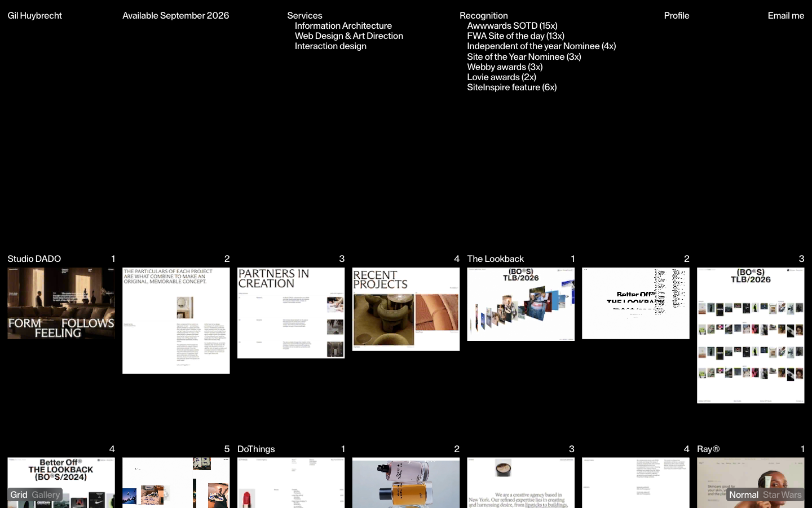
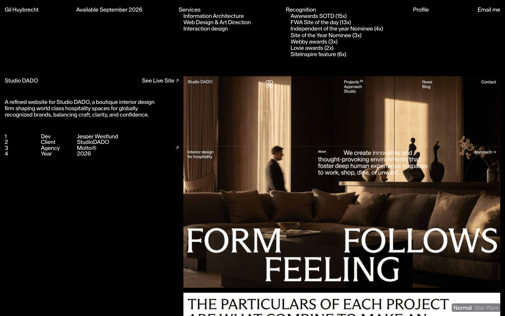
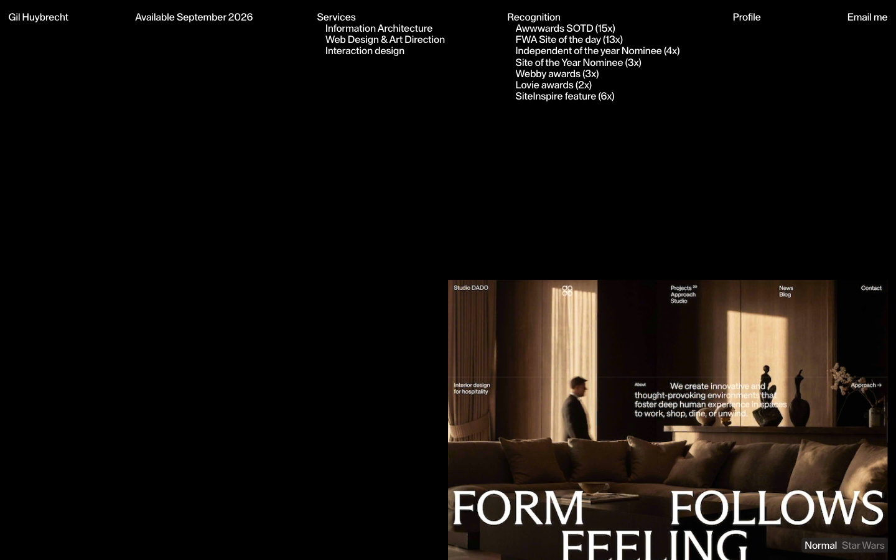

# Gil Huybrecht — Freelance designer & art director

- **URL**: https://gilhuybrecht.com/
- **리뷰 날짜**: 2026-09-21
- **수상**: Awwwards SOTD 15회, FWA SOTD 13회, Webby 3회 (사이트 자체 표기)

## 분류 태그 (검색용)

- **스타일**: #미니멀 #타이포중심 #화이트 #에디토리얼
- **업종·용도**: #포트폴리오 #디자이너개인
- **인터랙션**: #뷰트랜지션 #FLIP #썸네일확대 #WebGL이미지 #스무스스크롤 #그리드갤러리전환

## 내가 좋았던 점 (사용자 작성)

> 미니멀한 디자인. 폰트도 X라인이 높아 트렌디하다.
> 이미지 클릭할 때 상세페이지로 전환되고 다시 리스트로 전환되는 모션이 평면적인 디자인을 입체감 있게 바꿔준다.
> 내가 미니멀한 디자인을 자주 하니, 이런 방식으로 입체감을 인터랙션으로 주는 것도 좋을 듯.

## 인터랙션 기술 분석 (Claude 작성)

### 스택 (번들 코드에서 실측 확인)
- **Nuxt(Vue) + Tailwind** — SPA, 프로젝트가 실제 라우트(`/projects/studio-dado`)로 전환됨
- **GSAP + Flip 플러그인**(참조 98회) + ScrollTrigger + CustomEase — 핵심 전환 엔진
- **Three.js WebGL**(WebGLRenderer·커스텀 셰이더 uniform 269회) — 그리드의 이미지들이 ``가 아니라 WebGL 플레인. 헤드리스에서 WebGL 차단 시 사이트가 500을 던질 정도로 렌더링의 중심
- **Lenis** — 스무스 스크롤
- 폰트: 셀프호스팅 커스텀 산세리프(`font-family: sans`). X-하이트가 높은 네오 그로테스크

### 주요 인터랙션

1. **리스트 → 상세 FLIP 전환 (사용자가 꼽은 그 효과)**
   - 썸네일 클릭 → 그 이미지가 **제자리에서 상세 히어로 크기로 확대**되고, 좌측에서 프로젝트 메타(Dev/Client/Agency/Year) 패널이 들어옴. 복귀 시 역재생으로 **다시 원래 그리드 칸으로 축소**.
   - 구현: GSAP **Flip** — 전환 전 위치를 `Flip.getState()`로 기록 → 라우트 전환(DOM 재배치) → `Flip.from(state)`가 두 상태의 좌표·크기 차이를 자동 보간. URL이 실제로 바뀌는 라우트 전환인데도 요소가 이어져 보이는 것이 포인트.
   - 같은 원리 데모: 패턴 라이브러리 [뷰 트랜지션](../../interaction-patterns/view-transition.html) (getBoundingClientRect 수동 FLIP 버전)
2. **WebGL 이미지 그리드** — 이미지를 Three.js 플레인으로 그려서, DOM으로는 불가능한 셰이더 왜곡·부드러운 스케일 보간이 가능. 전환 중 이미지가 "살아있는" 느낌의 근원.
3. **Grid ↔ Gallery 뷰 토글** — 같은 콘텐츠를 두 레이아웃으로 재배열(이것도 FLIP 계열).
4. **로딩 시퀀스** — % 카운터 + 이미지가 흩어진 상태에서 그리드로 정렬되며 시작.

### 따라 할 때 조언

- **80% 재현은 쉽습니다**: 미니멀 그리드 + GSAP Flip 전환까지는 WebGL 없이 일반 DOM ``로 충분합니다. `Flip.getState(img)` → 상세 레이아웃으로 DOM 이동 → `Flip.from(state, {duration:0.8, ease:'power3.inOut', absolute:true})` 한 사이클이 전부. 우리 view-transition 데모가 그 골격입니다.
- **입체감의 비밀은 '연속성'**: 평면적 미니멀 디자인에서 입체감은 그림자·3D가 아니라 **요소가 화면을 가로질러 이어지는 것**에서 나옵니다. 클릭한 것이 커지고, 닫으면 제자리로 돌아가는 왕복 대칭이 핵심이라, 들어갈 때만 만들고 나올 때를 생략하면 효과가 반감됩니다.
- **성능 주의**: WebGL 이미지 그리드는 저사양·모바일에서 부담이 큽니다(이 사이트도 로딩이 김). 실무에선 DOM 버전을 기본으로, WebGL은 데스크톱에서만 점진적 적용을 권장.
- **SPA가 아니면**: 요즘은 브라우저 네이티브 **View Transitions API**(`document.startViewTransition` + `view-transition-name`)로 멀티페이지에서도 같은 효과가 됩니다. 신규 프로젝트면 이쪽이 더 가벼운 선택지.

## 스크린샷

| | |
|---|---|
|  |  |

