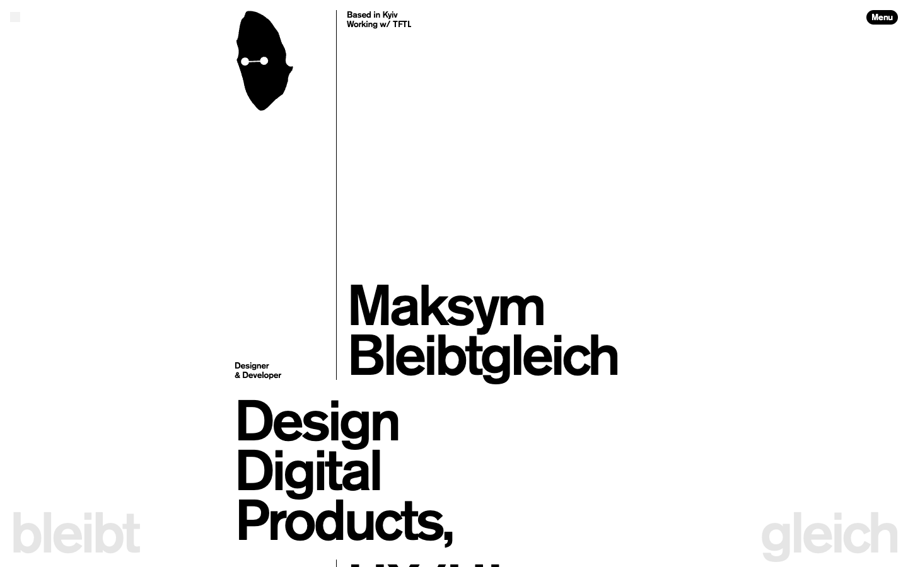
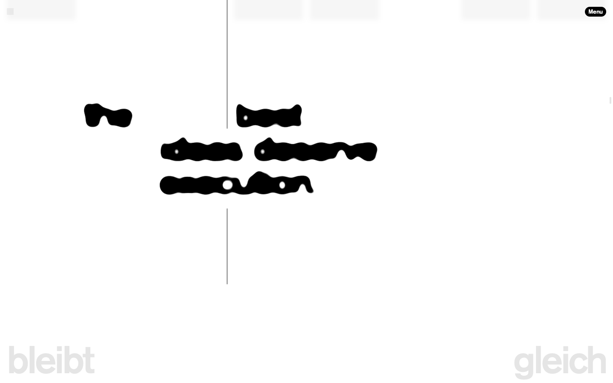
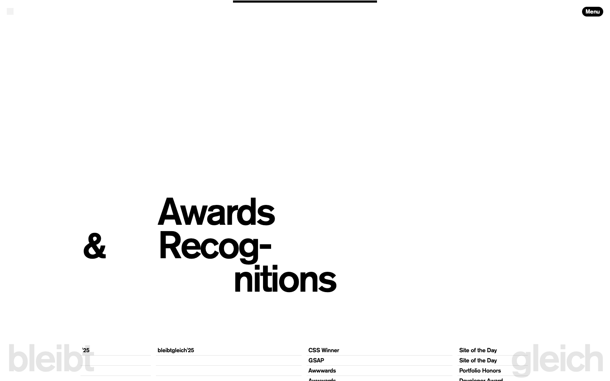

# Maksym Bleibtgleich — Designer & Developer

- **URL**: https://bleibtgleich.dev/
- **리뷰 날짜**: 2026-09-28

## 분류 태그 (검색용)

- **스타일**: #미니멀 #타이포중심 #화이트 #스위스그리드
- **업종·용도**: #포트폴리오 #디자이너개인
- **인터랙션**: #플루이드텍스트 #구이필터 #스크롤리빌 #스무스스크롤

## 내가 좋았던 점 (사용자 작성)

> 스크롤을 내리면서 폰트가 플루이드 효과가 되면서 나타나는 것.

## 인터랙션 기술 분석 (Claude 작성)

### 스택 (페이지에서 실측 확인)
- **GSAP 3.15 + ScrollTrigger + Lenis** — 스무스 스크롤 위에서 섹션 진입 시 재생
- 키이우(Kyiv) 기반 디자이너·개발자의 개인 포트폴리오. Webflow 기반(w-dyn-item 클래스 흔적)

### 주요 인터랙션

1. **플루이드(구이) 텍스트 리빌 (사용자가 꼽은 그 효과)**
   - 글자가 잉크 방울처럼 녹아 뭉쳐 있다가, 섹션이 뷰포트에 들어오면 굳으면서 또렷한 활자로 변함.
   - 구현: JS 물리엔진이 아니라 **SVG 필터 2줄**. `feGaussianBlur stdDeviation=50`으로 글자를 뭉개고,
     `feColorMatrix`의 알파 행 `0 0 0 20 -8`(알파×20−8)로 반투명 경계를 잘라내면
     흐림이 "가장자리가 쫀득한 액체"로 변함 — 고전적인 gooey 기법의 타이포 적용.
   - 줄마다 고유 필터 id(`goo-xxxxx`)를 만들어 개별 제어. blur 50→0, 대비 20→1로 되돌리면 잉크가 굳음.
   - 이 사이트는 스크럽이 아니라 **진입 시 1회 재생형**(약 1초). 우리 데모는 스크럽형으로 변형해 위로 올리면 다시 녹게 만듦.
   - 재현 데모: **[플루이드 텍스트](../../interaction-patterns/fluid-text.html)** — 재현하며 잡은 포인트는
     blur와 대비를 같이 풀면 중간이 그냥 흐릿해진다는 것. 대비는 진행 70%까지 유지하다가 마지막에 풀어야 끝까지 액체로 보임.
2. **거대 고스트 타이포** — 화면 좌우 하단에 연회색 "bleibt / gleich"가 고정되어 브랜드를 각인.
3. **오빗 타일 블러** — 프로젝트 썸네일 띠가 `blur + brightness` 필터로 흐려져 있다가 초점이 맞으며 등장.
4. **스위스 그리드 + 세로 괘선** — 콘텐츠를 가르는 얇은 세로선과 어긋난 정렬로 미니멀한데 리듬이 있음.

### 따라 할 때 조언

- **난이도 낮음**: WebGL 없이 SVG 필터 + GSAP만으로 되므로 도입 장벽이 낮은 편. 텍스트가 이미지가 아니라 진짜 DOM 텍스트라 접근성·SEO도 유지됨.
- **성능 주의**: SVG 필터는 GPU 부담이 커서 ①텍스트 블록 단위로만 적용 ②전환이 끝나면 `filter` 제거 ③한 화면에 동시에 여러 개 녹이지 않기. 모바일 사파리에서 특히 확인할 것.
- **디자인 팁**: 굵은 웨이트(700~800)일수록 덩어리가 예쁘게 뭉침. 얇은 글자는 블러 단계에서 끊어져 액체 느낌이 안 남.

## 스크린샷

| | |
|---|---|
|  |  |

