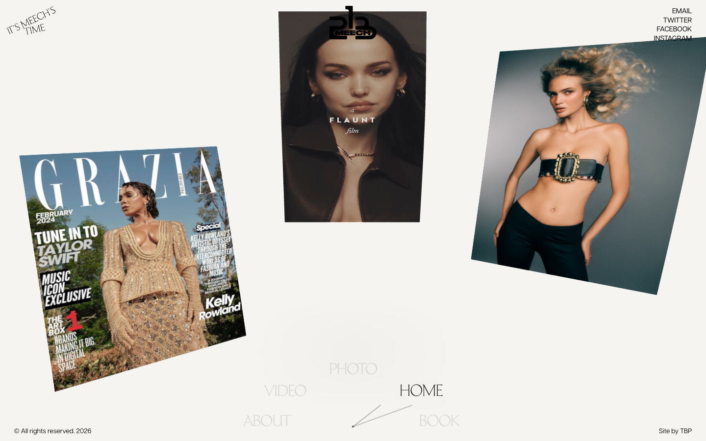
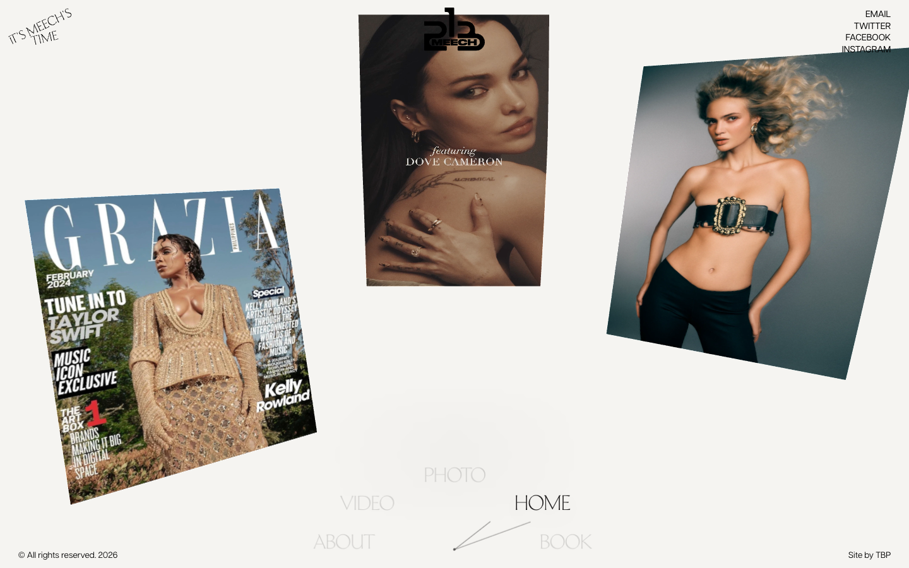
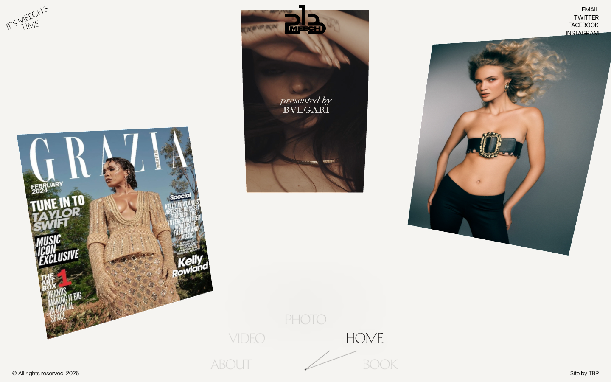

# Meech213 — Photography & Film by Dametreus Ward

- **URL**: https://www.meech213.com/
- **리뷰 날짜**: 2026-09-28

## 분류 태그 (검색용)

- **스타일**: #미니멀 #크림톤 #패션 #매거진
- **업종·용도**: #포트폴리오 #포토그래퍼
- **인터랙션**: #롤링갤러리 #원통캐러셀 #WebGL이미지 #비디오텍스처 #다이얼내비

## 내가 좋았던 점 (사용자 작성)

> 이미지·영상들이 입체감 있게 돌아가면서 롤링되는 것.
> 가운데가 작고 양쪽이 크게 감싸는 구도가 인상적.

## 인터랙션 기술 분석 (Claude 작성)

### 스택 (페이지에서 실측 확인)
- **WebGL 캔버스 1장이 갤러리 전체를 렌더** — 이미지 27장·비디오 20개를 GPU 텍스처로 사용. Next.js(Turbopack) 빌드
- LA 기반 포토그래퍼 Dametreus Ward의 포트폴리오. Site by TBP

### 주요 인터랙션

1. **원통형 롤링 갤러리 (사용자가 꼽은 그 효과)**
   - 이미지·영상 패널이 평면이 아니라 **원통 면에 감긴 곡면 조각**이고, 드래그하면 원통이 관성으로 회전.
   - 핵심 구도: 카메라가 원통 **안**에 있는 오목(concave) 시점 — 정면(건너편 벽)은 작게,
     양옆 벽은 카메라를 감싸며 크고 극적으로 휘어 보임. 카메라를 밖에 두면(볼록) 반대로 가운데가 커짐.
   - 재현 데모: **[3D 롤링 갤러리](../../interaction-patterns/rolling-gallery.html)** —
     Three.js `CylinderGeometry` 호 조각 + 드래그/휠 관성. 오목(레퍼런스)/볼록 토글 포함.
     오목 시점에선 ①안쪽에서 보면 이미지가 거울상 → `scale.x=-1` 보정 ②드래그 체감 방향 반전, 두 가지가 필수.
2. **비디오 텍스처** — 영상도 `VideoTexture`로 같은 원통 위에서 재생되어 사진·영상이 한 덩어리로 굴러감.
3. **시계(다이얼) 내비게이션** — 하단 메뉴가 원호를 따라 배치되고 바늘이 가리키는 방식(clock-menu). 갤러리의 회전 모티프와 통일.
4. **크림 배경 + 매거진 타이포** — 지면(紙面) 느낌의 배경 위에 커버·화보가 실물 인쇄물처럼 흩어져 있는 무드.

### 따라 할 때 조언

- 회전·관성·곡면 배치는 Three.js 기본기로 충분(셰이더 불필요). 어려운 건 효과가 아니라 **성능 관리** — 원본처럼 텍스처 47장을 쓰면 로딩·메모리가 무거워지므로, 저해상도 텍스처로 시작해 가까워질 때 고해상도로 교체하는 LOD 전략을 권장.
- 비디오 텍스처는 **muted + playsinline**이어야 자동재생되고, 막히면 첫 인터랙션에서 `play()` 재시도.
- 오목 시점은 fov와 카메라 삽입 깊이(중심에서 벽 쪽으로 얼마나)로 "감싸는 정도"가 결정됨. 데모 기준 fov 52 / 반지름 14 / 카메라 z 7.5.

## 스크린샷

| | |
|---|---|
|  |  |

