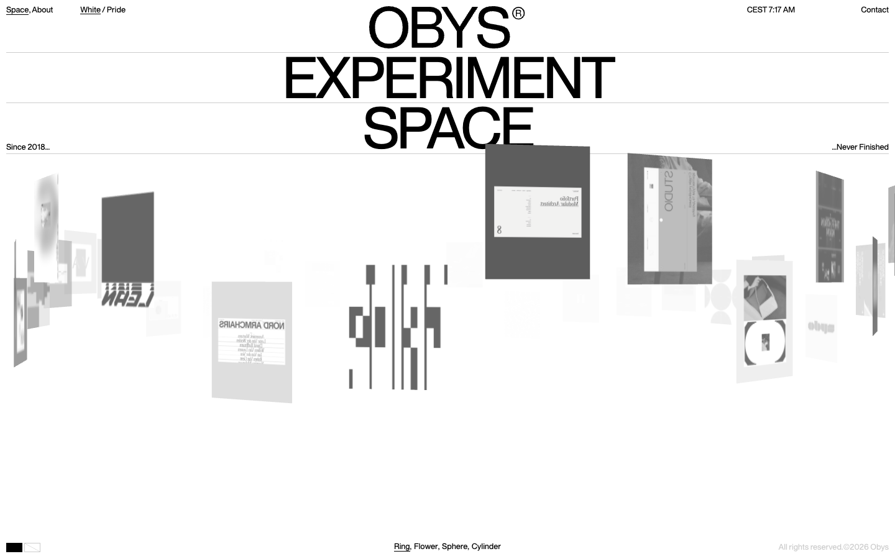
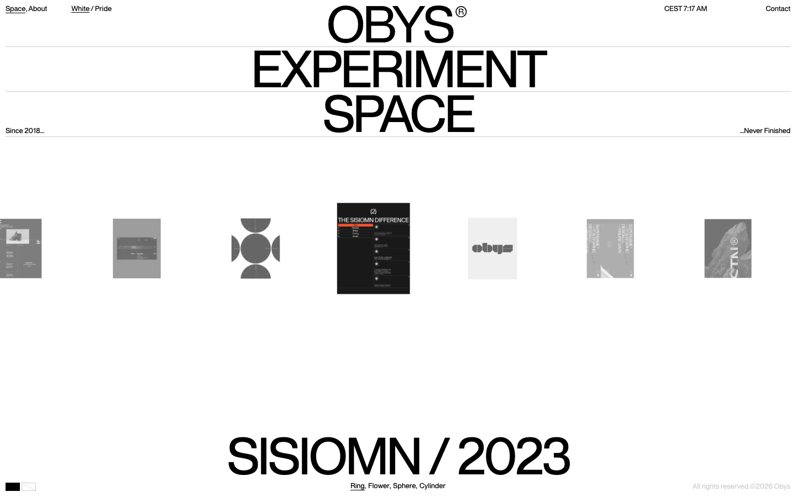
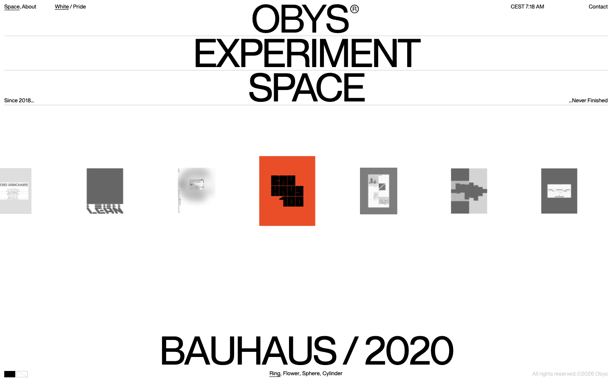

# Obys® Experiment Space — Unpublished Works & Experiments

- **URL**: https://experiment.obys.agency/
- **리뷰 날짜**: 2026-09-29

## 분류 태그 (검색용)

- **스타일**: #미니멀 #흑백 #화이트 #실험적 #타이포중심
- **업종·용도**: #에이전시 #아카이브 #실험공간
- **인터랙션**: #3D링갤러리 #휠하이재킹 #포메이션전환 #클릭상세 #WebGL이미지 #뒷면거울상

## 내가 좋았던 점 (사용자 작성)

> 스크롤하면 이미지들이 좌우로 입체감 있게 움직이는 것.
> 클릭하면 갤러리(상세)로 이어지는 것까지.

## 인터랙션 기술 분석 (Claude 작성)

### 스택 (페이지에서 실측 확인)
- **Webflow + GSAP 3.12 + SplitType + WebGL 캔버스 1장**(Three.js 번들)
- **스크롤 높이 = 화면 높이(998px)** — 네이티브 스크롤이 아예 없고, **휠 입력을 가로채(hijack) WebGL 카메라·링 회전에 매핑**
- Obys(우크라이나 에이전시)의 미공개 작업 아카이브. 하단에 Ring, Flower, Sphere, Cylinder 모드 표기

### 주요 인터랙션

1. **3D 이미지 링 (사용자가 꼽은 그 효과)**
   - 프로젝트 이미지들이 눈높이의 큰 원 위에 바깥을 향해 세워져 있고, 휠을 굴리면 링이 회전.
     정면 카드는 크고 평평하게, 옆 카드는 기울어지며 좌우로 흘러가 "좌우로 입체감 있게 움직이는" 느낌이 남.
   - 디테일: 반대편 카드의 **뒷면이 거울상으로 비침**(DoubleSide) — 공간감을 만드는 숨은 주역.
   - 회전이 멈추는 각도에 맞춰 하단에 프로젝트 라벨(예: SISIOMN / 2023)이 교체됨.
2. **포메이션 전환** — Ring/Flower/Sphere/Cylinder 4가지 배치로 같은 이미지들이 재배열됨.
3. **클릭 → 상세 갤러리** — 카드를 클릭하면 그 프로젝트가 정면으로 나오며 상세로 이어짐.
4. **재현 데모**: **[포메이션 갤러리](../../interaction-patterns/formation-gallery.html)** —
   링 회전(관성)+거울상, 4포메이션 GSAP 전환, 클릭 상세(카드 정면 확대+고스트 처리+추가 컷 스트립+복귀)까지 재현.
   핵심 구현: 클릭 카드를 `scene.attach()`로 회전 그룹에서 월드 좌표 유지한 채 분리 → 카메라 앞으로 트윈.

### 따라 할 때 조언

- 링 배치 자체는 Three.js 기본기(위치 = sin/cos, rotY = 각도). 어려운 건 **휠 하이재킹의 관성 튜닝** — 속도 누적 후 마찰(×0.94 내외)로 감속시키면 원본의 묵직한 감이 남.
- 휠 하이재킹은 **접근성 비용**이 큼(키보드·스크린리더 스크롤 상실). 실무 적용 시 일반 페이지에는 권장하지 않고, 이런 아카이브·전시형 단일 화면에만.
- 뒷면 거울상은 DoubleSide 한 줄이지만 공간감 기여가 커서 끄지 말 것. 흑백 톤은 텍스처에 `?grayscale`만 붙여도 무드가 산다.

## 스크린샷

| | |
|---|---|
|  |  |

